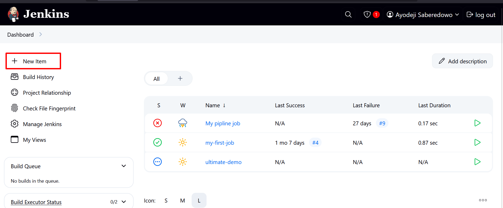
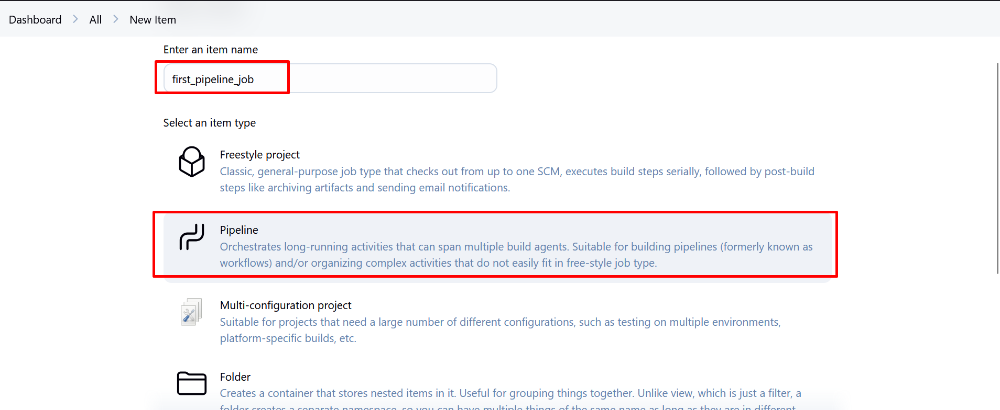
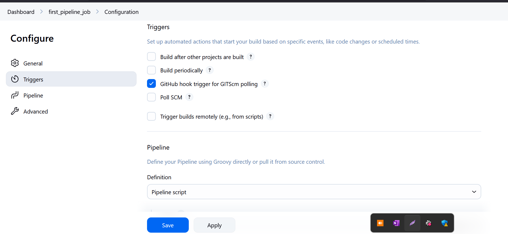
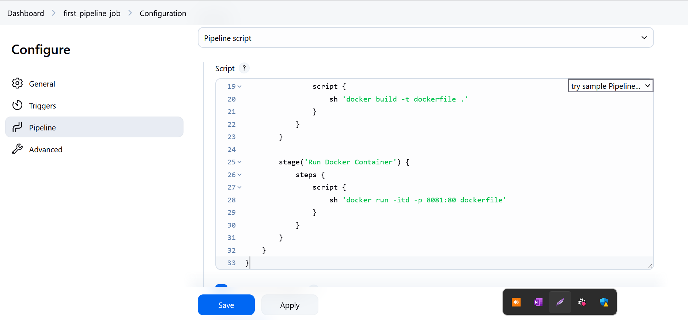

# Jenkins Pipeline Project

### What is a Jenkins Pipeline Job

A Jenkins pipeline job is a way to define and automate a series of steps
in the software delivery process. It allows you to script and organize
your entire build, test, and deployment. Jenkins pipelines enable
organizations to define, visualize, and execute intricate build, test,
and deployment processes as code. This facilitates the seamless
integration of continuous integration and continuous delivery (CI/CD)
practices into software development.

### Creating a Pipeline Job

Let's create our first pipeline job



i. From the dashboard menu on the left side, click on new item  



ii. Create a pipeline job and name it "first pipeline job"

### Configuring Build Trigger

Create a build trigger for jenkins to trigger new build

i.  Click "Configure" your job and add this configurations  
ii. Click on build trigger to configure triggering the job from GitHub webhook


iii. Create a github webhook.

### Writing Jenkins Pipeline Script

A jenkins pipeline script refers to a script that defines and
orchestrates the steps and stages of a continuous integration and
continuous delivery (CI/CD) pipeline. Jenkins pipelines can be defined
using either declarative or scripted syntax. Declarative syntax is a
more structured and concise way to define pipelines. It uses a
domain-specific language to describe the pipeline stages, steps, and
other configurations while scripted syntax provides more flexibility and
is suitable for complex scripting requirements.

Let's write our pipeline script

``` groovy
pipeline {
    agent any

    stages {
        stage('Connect To Github') {
            steps {
                checkout scmGit(
                    branches: [[name: '*/main']],
                    extensions: [],
                    userRemoteConfigs: [[
                        url: 'https://github.com/Sabhayor/jenkins_pipeline.git'
                    ]]
                )
            }
        }

        stage('Build Docker Image') {
            steps {
                script {
                    sh 'docker build -t dockerfile .'
                }
            }
        }

        stage('Run Docker Container') {
            steps {
                script {
                    sh 'docker run -itd -p 8081:80 dockerfile'
                }
            }
        }
    }
}
```

**Explanation of the script above**

The provided Jenkins pipeline script defines a series of stages for a continuous integration and continuous delivery (CI/CD) process. Let's
break down each stage:

**Agent Configuration:**

``` groovy
agent any
```

Specifies that the pipeline can run on any available agent (an agent can
either be a jenkins master or node). This means the pipeline is not tied
to a specific node type.

**Stages:**

``` groovy
stages {
// Stages go here
}
```

Defines the various stages of the pipeline, each representing a phase in
the software delivery process.

**Stage 1: Connect To Github:**

``` groovy
stage('Connect To Github') {
    steps {
        checkout scmGit(
            branches: [[name: '*/main']]
            extensions: [],
            userRemoteConfigs: [[
                url: 'https://github.com/Sabhayor/jenkins_pipeline.git'
            ]]
        )
    }
}
```

This stage checks out the source code from a GitHub repository
(https://github.com/Sabhayor/jenkins_pipeline.git). It specifies that the pipeline should use the 'main' branch.

**Stage 2: Build Docker Image:**

``` groovy
stage('Build Docker Image') {
    steps {
        script {
            sh 'docker build -t dockerfile .'
        }
   }
}
```

This stage builds a Docker image named 'dockerfile' using the source
code obtained from the GitHub repository. The docker build command is
executed using the shell (sh).

**Stage 3: Run Docker Container:**

``` groovy
stage('Run Docker Container') {
    steps {
        script {
            sh 'docker run -itd --name nginx -p 8081:80 dockerfile'
        }
   }
}
```

This stage runs a Docker container named 'nginx' in detached mode
(-itd). The container is mapped to port 8081 on the host machine (-p
8081:80). The Docker image used is the one built in the previous stage
('dockerfile').

Copy the pipeline script and paste it in the section below




### Installing Docker

Before jenkins can run docker commands, we need to install docker on the
same instance jenkins was installed. From our shell scripting
knownledge, let's install docker with shell script

i.  Create a file named docker.sh  

ii. Open the file and paste the script below

``` bash
sudo apt-get update -y
sudo apt-get install ca-certificates curl gnupg
sudo install -m 0755 -d /etc/apt/keyrings
curl -fsSL https://download.docker.com/linux/ubuntu/gpg | sudo gpg --dearmor -o /etc/apt/keyrings/docker.gpg
sudo chmod a+r /etc/apt/keyrings/docker.gpg

# Add the repository to Apt sources:
echo   "deb [arch=$(dpkg --print-architecture) signed-by=/etc/apt/keyrings/docker.gpg] https://download.docker.com/linux/ubuntu   $(. /etc/os-release && echo "$VERSION_CODENAME") stable" |   sudo tee /etc/apt/sources.list.d/docker.list > /dev/null
sudo apt-get update -y
sudo apt-get install docker-ce docker-ce-cli containerd.io docker-buildx-plugin docker-compose-plugin -y
sudo systemctl status docker
```

iii. Save and close the file  
iv Make the file executable

``` bash
chmod u+x docker.sh
```

v.  Execute the file\

``` bash
./docker.sh
```

We have successfully installed docker.

**Writting Dockerfile Script**\
Now that we have docker installed on the same instance with jenkins, we
need to create a dockerfile before we can run our pipeline script. As we
know, we cannot build a docker image without a dockerfile.

i.  Create a new file named dockerfile\
ii. Paste the code snippet below in the file

``` dockerfile
# Use the official NGINX base image
FROM nginx:latest
# Set the working directory in the container
WORKDIR  /usr/share/nginx/html/
# Copy the local HTML file to the NGINX default public directory
COPY index.html /usr/share/nginx/html/
# Expose port 80 to allow external access
EXPOSE 80
```

iii. Create an index.html file and paste the content below

``` html
Congratulations, You have successfully run your first pipeline code.
```

Pushing these files dockerfile and index.html will trigger jenkins to
automatically run new build for our pipeline